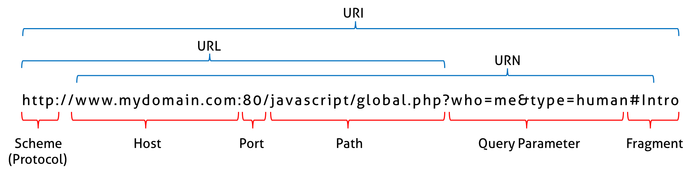

# 🥦 URL 구조

URL 구조는 여러 부분으로 구성되며, 각 부분은 웹에서 리소스를 식별하고 찾는 데 특정한 목적을 가지고 있습니다. URL의 일반적인 구조는 다음과 같습니다:

프로토콜: 프로토콜은 인터넷을 통해 데이터를 전송하는 데 사용되는 방법을 지정합니다. 웹에서 가장 일반적으로 사용되는 프로토콜은 HTTP와 HTTPS입니다.

도메인: 도메인 이름은 리소스를 호스팅하는 웹사이트 또는 서버를 식별합니다. .com, .org, .net과 같은 최상위 도메인 또는 .us, .uk와 같은 국가 코드 도메인이 될 수 있습니다.

하위 도메인: 하위 도메인은 도메인 이름 앞에 오는 URL의 선택적 부분입니다. blog.example.com 또는 store.example.com과 같이 웹사이트의 특정 섹션 또는 하위 도메인을 식별하는 데 사용됩니다.

경로: 경로는 서버에서 리소스의 위치를 지정합니다. 슬래시(/)로 구분된 하나 이상의 세그먼트로 구성됩니다. 경로에는 디렉터리, 파일 이름 및 쿼리 매개 변수가 포함될 수 있습니다.

쿼리 매개변수: 쿼리 매개변수는 키-값 쌍의 형태로 서버에 추가 정보를 전달하는 데 사용됩니다. 경로와 물음표(?)로 구분하고 서로 앰퍼샌드(&)로 구분합니다.

프래그먼트: 조각은 리소스의 특정 섹션을 식별하는 URL의 선택적 부분입니다. 파운드 기호(#)와 조각 식별자로 표시됩니다.

예를 들어 다음은 위에서 설명한 모든 구성 요소를 포함하는 URL입니다:

https://www.example.com/blog/article?id=1234#comments

* Protocol: HTTPS
* Domain: [www.example.com](http://www.example.com/)
* Subdomain: blog
* Path: /article
* Query parameter: id=1234
* Fragment: #comments

<figure><figcaption></figcaption></figure>

URL의 여러 부분을 이해하는 것은 웹 개발자와 사용자 모두에게 중요하며, 이를 통해 웹을 탐색하고 리소스에 더 효과적으로 액세스할 수 있기 때문입니다.
